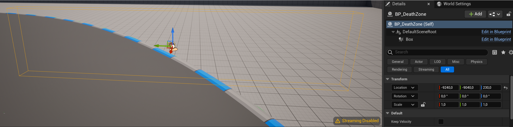

# Unreal_Template_Cars
Simple car template pour unreal created by G. DEMORGNY pour BRASSART

Actual version supported : 5.3.2
Use chaos Véhicules

## TODOLIST ##

- [ ] Cooldown
- [ ] Lap Number
- [ ] Finish
- [ ] CheckPoints
- [ ] Reset
- [ ] Boost
- [ ] Spawn d'objets

## FONCTIONNALITES PRESENTES ##

- Véhicules controllés par des IA simples
- Possibilité de régler le niveau des conducteurs
- Suivi d'une spline prédéfinie

## FICHIERS IMPORTANTS ##

Voitures :
- BP_CustomPlayerVehicule : Base pour la voiture du joueur
- BP_DriverAI : Base pour toutes les IA

Autres Elements :
- BP_SplineRace : BP qui sert de base aux trajectoires des IA, indispensable aux IA pour rouler
- GM_TemplateGameMode : GameMode Utilisé pour les configurations des IA. Indispensable aux IA pour rouler.
- BP_DeathZone : Volume qui fait respawn la voiture qui le traverse à son dernier point de respawn (soit un checkpoint soit le début).
On peut régler une valeur nommée KeepVelocity à vrai ou faux. A vrai, La vitesse sera concervée après le respawn, à faux elle ne sera pas gardée. 
